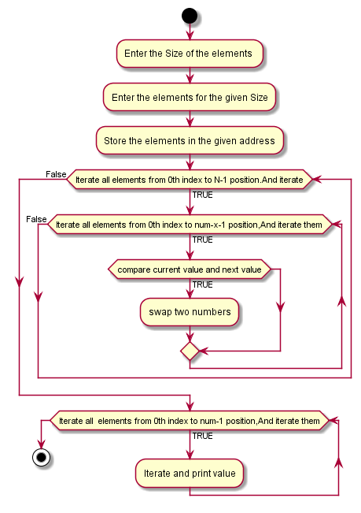

# Bubble sort  of 15 numbers provided by users:-
 To create a program which is used To find the bubble sort of 15 numbers provided by users.
### Working:
- Start at the beginning of the list.
- Compare the first value in the list with the next one up.
- If the first value is bigger, swap the positions of the two values.
- Move to the second value in the list. 
- Keep going until the there are no more items to compare.
- Go back to the start of the list
### Following flow chat for the task:
   